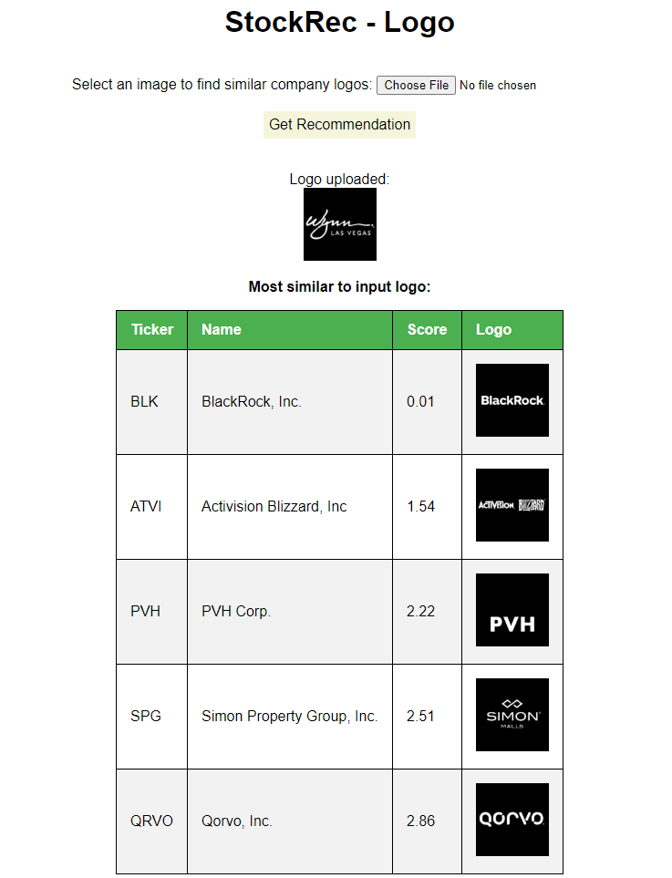

# StockRec - Logo

One approach to betting on horse racing is to use the jersey color (particularly for those like me who don't really bet on horses). Why not apply this to selecting stocks (other than it being a terrible idea)? Upload an image and the most similar company logos will be returned.

This uses data already scraped using a script from my other project: <https://github.com/james-kennedy/StockRec>. See steps 1-3 to download new data, but this repo includes a snapshot of the results in `spy_data.json` for use without doing that.

The code will process the scraped data, download logos, and profile them in the color space. Any submitted image is compared to these logos and the closest five are returned.

## To Run the Code

Developed using Python 3.7 on Windows 10, tested on Brave browser.

1. Install Python packages:
```
pip install -r requirements.txt
```

2. Run:
```
python run_system.py
```

## Screenshot


